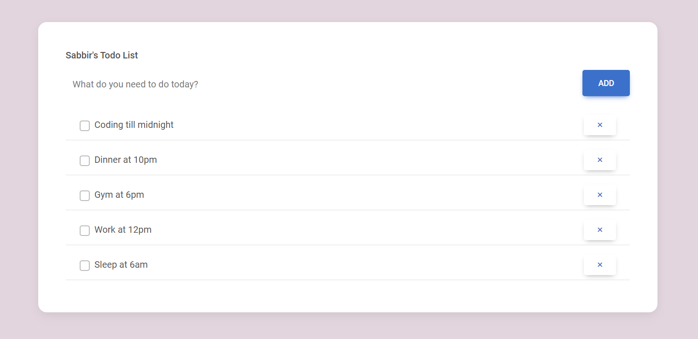

<!-- PROJECT LOGO -->
<br />
<div align="center">


<h2 align="center"> To-do list</h2>

  <p align="center">The to-do list is a web app allowing users to add, mark, and delete tasks. Built with JavaScript, 
jQuery, and Axios on the frontend, and Laravel PHP on the backend, it offers seamless task management through AJAX requests 
without page reloads. Users can access their tasks across sessions,
making it a convenient tool for organizing and boosting productivity.</p>


</div>


<!-- TABLE OF CONTENTS -->
<details>
  <summary>Table of Contents</summary>
  <ol>
    <li>
      <a href="#about-the-project">About The Project</a>
    </li>
    <li>
      <a href="#getting-started">Getting Started</a>
    </li>
    <li><a href="#product-requirement-and-roadmap">Product Requirement and Roadmap
</a></li>
    <li><a href="#database-design">Database Design</a></li>
    <li><a href="#contact">Contact</a></li>
    <li><a href="#acknowledgments">Acknowledgments</a></li>
  </ol>
</details>


<!-- ABOUT THE PROJECT -->

## About The Project

To-do crud module using Laravel Framework.

<p align="right">(<a href="#readme-top">back to top</a>)</p>

### Built With

List of notable Technologies used to build this applications.

* [![Laravel][Laravel.com]][Laravel-url]
* [![Bootstrap][Bootstrap.com]][Bootstrap-url]
* [![JQuery][JQuery.com]][JQuery-url]


<p align="right">(<a href="#readme-top">back to top</a>)</p>


<!-- GETTING STARTED -->

## Getting Started

### Prerequisites

* Laravel 10
* PHP 8.1+
* Composer (dependency manager for PHP)
* Database (MySQL/ PostgreSQL/ SQLite/ SQL Server)
* Git

### Installation

Please Follow the steps to install this project Locally.

#### 1. Clone the repo

Open your terminal and navigate to the directory where you want to install the Laravel project.
Then run the following command:

   ```sh
   git clone https://github.com/Sabbir-Hossain12/Note-taking-App.git
   ```

#### 2. Navigate to Project Directory

Move into the project directory:

   ```sh
   cd Note-taking-App
   ```

#### 3. Install Dependencies

Once you are in the project directory, use Composer to install the required dependencies:

   ```sh
   composer install
   ```

#### 4. Create Environment File

Laravel requires an environment file for configuration. Duplicate the .env.example file and save it as .env:

   ```sh
   cp .env.example .env
   ```

#### 5. Generate Application Key

Run the following command to generate a unique application key:

   ```sh
php artisan key:generate
   ```

#### 6. Run Migrations

Use the following command to run database migrations:

   ```sh
  php artisan migrate
   ```   

#### 7. run the database seeders for dummy data

Use the following command to run database seeders:

   ```sh
  php artisan db:seed
   ```   

#### 8. Serve the Application

You can use Laravel's built-in development server to run the application locally.
Execute the following command:

```sh
php artisan serve
```   

This will start a development server, and you can access your Laravel application at http://127.0.0.1:8000 in your web
browser.
<p align="right">(<a href="#readme-top">back to top</a>)</p>


<!-- ROADMAP -->

## Product Requirement and Roadmap

1. User Authentication:
    - Implement user registration, login, and logout functionalities.
    - Ensure secure authentication for accessing user-specific notes.
2. Note Management:
    - Allow users to create, edit, and delete notes.
    - Each note should have a title, content, creation date, and last modified date.
3. Implement CRUD operations for managing notes.
    - Search Functionality:
    - Implement a search feature for users to find notes based on titles or content.
4. User interface
    - Utilize the provided Bootstrap template from Bootstrap Examples for designing
      the user interface.
    - Design an intuitive and user-friendly interface for creating, viewing, and
      managing notes.

### Features

- Laravel Breeze for Authentication(login,registration,forget password,logout)
- Dynamic User Name on top right corner of Dashboard.
- Dynamic Dashboard shows the total number of Notes for the Specific User.
- List of Total Notes for the specific User managed by Jquery Datatable plugin.
- Edit, Delete, Search, pagination, custom entry and Create Notes Dynamically Using Ajax architecture(axios library).
- user-friendly interface for creating, viewing, and
  managing notes.

<p align="right">(<a href="#readme-top">back to top</a>)</p>


<!-- CONTACT -->

## Contact

Sabbir Hossain- h.sabbir36@yahoo.com

Project Link: https://github.com/Sabbir-Hossain12/Note-taking-App

<p align="right">(<a href="#readme-top">back to top</a>)</p>


<!-- ACKNOWLEDGMENTS -->

## Acknowledgments

i would like to give credit to some of the resources down below that helped my project.

* [Font Awesome](https://fontawesome.com)
* [Bootstrap](https://getbootstrap.com/)
* [Data Table](https://datatables.net/)
* [Axios]()
* [Toastify JS]()

<p align="right">(<a href="#readme-top">back to top</a>)</p>


<!-- MARKDOWN LINKS & IMAGES -->
<!-- https://www.markdownguide.org/basic-syntax/#reference-style-links -->

[contributors-shield]: https://img.shields.io/github/contributors/othneildrew/Best-README-Template.svg?style=for-the-badge

[contributors-url]: https://github.com/othneildrew/Best-README-Template/graphs/contributors

[forks-shield]: https://img.shields.io/github/forks/othneildrew/Best-README-Template.svg?style=for-the-badge

[forks-url]: https://github.com/othneildrew/Best-README-Template/network/members

[stars-shield]: https://img.shields.io/github/stars/othneildrew/Best-README-Template.svg?style=for-the-badge

[stars-url]: https://github.com/othneildrew/Best-README-Template/stargazers

[issues-shield]: https://img.shields.io/github/issues/othneildrew/Best-README-Template.svg?style=for-the-badge

[issues-url]: https://github.com/othneildrew/Best-README-Template/issues

[license-shield]: https://img.shields.io/github/license/othneildrew/Best-README-Template.svg?style=for-the-badge

[license-url]: https://github.com/othneildrew/Best-README-Template/blob/master/LICENSE.txt

[linkedin-shield]: https://img.shields.io/badge/-LinkedIn-black.svg?style=for-the-badge&logo=linkedin&colorB=555

[linkedin-url]: https://linkedin.com/in/othneildrew

[product-screenshot]: images/screenshot.png

[Next.js]: https://img.shields.io/badge/next.js-000000?style=for-the-badge&logo=nextdotjs&logoColor=white

[Next-url]: https://nextjs.org/

[React.js]: https://img.shields.io/badge/React-20232A?style=for-the-badge&logo=react&logoColor=61DAFB

[React-url]: https://reactjs.org/

[Vue.js]: https://img.shields.io/badge/Vue.js-35495E?style=for-the-badge&logo=vuedotjs&logoColor=4FC08D

[Vue-url]: https://vuejs.org/

[Angular.io]: https://img.shields.io/badge/Angular-DD0031?style=for-the-badge&logo=angular&logoColor=white

[Angular-url]: https://angular.io/

[Svelte.dev]: https://img.shields.io/badge/Svelte-4A4A55?style=for-the-badge&logo=svelte&logoColor=FF3E00

[Svelte-url]: https://svelte.dev/

[Laravel.com]: https://img.shields.io/badge/Laravel-FF2D20?style=for-the-badge&logo=laravel&logoColor=white

[Laravel-url]: https://laravel.com

[Bootstrap.com]: https://img.shields.io/badge/Bootstrap-563D7C?style=for-the-badge&logo=bootstrap&logoColor=white

[Bootstrap-url]: https://getbootstrap.com

[JQuery.com]: https://img.shields.io/badge/jQuery-0769AD?style=for-the-badge&logo=jquery&logoColor=white

[JQuery-url]: https://jquery.com 
